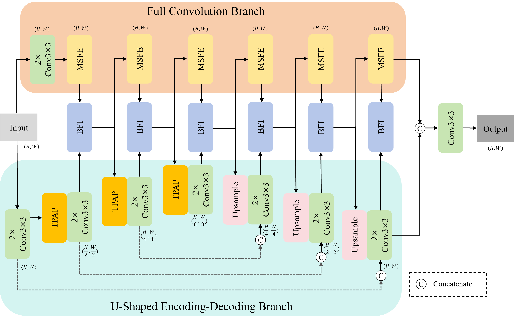

# BDPNet
This is the official repository for **"Bidirectional Dual-Path CNN with Multi-Scale Feature Fusion for Enhanced Medical Image Segmentation"**.

# Architecture

# Dataset Structure
The dataset is organized as follows:

- `dataset/`
  - `dataset_name/`: Name of the dataset used, e.g., BUSI, Brain MRI, and KvasirSEG
    - `train/`: Contains training data
      - `img/`: Training images
      - `mask/`: Corresponding segmentation masks for training images
    - `test/`: Contains test data
      - `img/`: Test images
      - `mask/`: Corresponding segmentation masks for test images

  - `dataset_name/`: Name of the dataset used, e.g., BUSI, Brain MRI, and KvasirSEG
    - .......

# Train and Test
Please use `Trainer.py` for model training and evaluation.  
Set `Net_mode = 1` for training mode, or `Net_mode = 0` for test mode.

# Datasets
The following datasets are used in this work:
<ol>
  <li><a href="https://scholar.cu.edu.eg/?q=afahmy/pages/dataset/">BUSI</a></li>
  <li><a href="https://www.kaggle.com/datasets/mateuszbuda/lgg-mri-segmentation/">Brain MRI</a></li>
  <li><a href="https://datasets.simula.no/kvasir-seg/">KvasirSEG</a></li>
</ol>

# Citation
If you find this code useful in your research, please consider citing our work:

> The manuscript has been submitted to *The Visual Computer*. The full citation will be updated when available.
